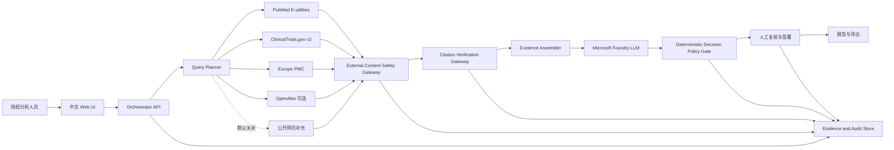
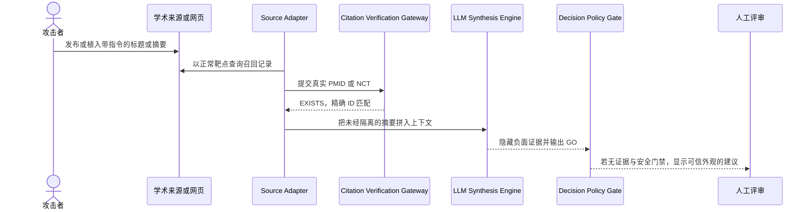

## 执行摘要

Drug Target Scout 应按高影响决策支持系统设计。系统可以生成 `GO`、`NO_GO`
或 `NEED_MORE_DATA` 建议草案，但不得自动批准研发立项、触发资金投入、改变试验设计，
也不得替代具备资质的药物研发评审人员。最终决定必须由经过授权的领域评审人签署。

本规划以技术研究结论为架构事实来源。PRD v0.1 中 Google Scholar 是必选数据源的
假设已失效，不进入组件清单或安全控制基线。实际证据源为：

* PubMed E-utilities 和 ClinicalTrials.gov API v2 作为主证据源
* Europe PMC 作为生物医学补充源
* OpenAlex 作为可选的跨学科与引用网络补充源
* 公开网页仅在产品明确启用时作为低信任补充源
* 同进程 Citation Verification Gateway 对 PMID 和 NCT 做权威存在性回查
* Microsoft Foundry 上的 LLM 倾向用于证据归纳与决策建议生成
* Azure Container Apps 是候选运行时，尚未最终确认

最高优先级风险是外部标题、摘要或网页片段携带间接 Prompt 注入指令。该攻击路径
技术上可行，而且 Citation Verification Gateway 无法阻止它。网关只能证明 PMID 或
NCT 对应记录存在，不能证明记录内容安全、相关、未被操纵，也不能证明记录支持某项
结论。一个真实存在的文献记录仍可能包含诱导模型忽略规则、隐藏负面证据或强制输出
`GO` 的文本。

上线前必须增加两个逻辑组件：

1. External Content Safety Gateway，对所有外部文本做规范化、来源标记、文档攻击检测、
   隔离和审计
2. Deterministic Decision Policy Gate，对模型输出做结构化校验、证据覆盖检查、失败降级
   和人工审批控制

Prompt Shields、系统提示词和 Spotlighting 都只能作为分层防御的一部分。任何单一模型
或过滤器都不能提供完整的 Prompt 注入防护。系统的主要安全保证必须来自最小权限、
模型无工具权限、确定性证据门禁、失败时转为 `NEED_MORE_DATA`，以及强制人工复核。

## 依据与优先级

本规划按以下优先级解释输入材料：

1. [技术假设研究](../../research/2026-08-20/drug-target-scout-technical-assumptions-research.md)
   决定数据源、字段语义、引用回查和降级规则
2. 用户在本次安全规划请求中确认的实际架构
3. [PRD v0.1](../../../prd-v0.1.md) 中未被研究推翻的产品目标、交互和非功能要求
4. Microsoft Learn、OWASP 和 NIST 的外部安全基线

Google Scholar 相关需求不进入实现范围。PRD 中的“Scholar / Web”描述只保留为一个
条件性公开网页补充能力，不得被误认为权威学术数据源。

## 安全目标

### 核心目标

* 保证进入关键结论的 PMID 和 NCT 均通过权威源精确回查
* 保证外部文本始终被当作数据，而不是可执行指令
* 防止任何单条补充证据或单个来源独立改变最终建议
* 防止模型直接访问凭据、网络、文件系统、数据库或有副作用的工具
* 保证每条关键结论可追溯到规范化证据、原始引用和验证结果
* 保证主证据缺失、冲突、验证失败或安全检测异常时转为 `NEED_MORE_DATA`
* 保证最终立项决定由授权人员完成，而不是由模型自动完成
* 保证模型、提示模板、过滤策略和数据处理变更可审计、可回滚

### 明确不提供的保证

PMID 或 NCT 的 `EXISTS` 状态不表示：

* 研究结论正确或可重复
* 论文未撤稿或没有关注声明
* 临床试验结果可信、完整或积极
* 文献与目标靶点存在高相关性
* 摘要内容未被恶意构造
* 证据足以支持研发立项

这些判断需要独立的证据质量、相关性、撤稿状态和领域评审控制。

## 使用边界与治理约束

### 允许用途

* 汇总公开的靶点、文献和临床试验证据
* 生成可追溯的初筛报告和建议草案
* 标记证据缺口、来源冲突、潜在风险和后续研究方向
* 帮助领域专家缩短人工检索和初步整理时间

### 禁止用途

* 自动批准或否决药物研发立项
* 自动执行采购、付款、合同、资源分配或对外发布
* 自动修改临床试验、患者治疗或医学建议
* 在 MVP 中处理患者级数据、受保护健康信息或未脱敏个人数据
* 让模型自行访问任意 URL、调用 shell、写数据库或发送消息
* 让补充来源覆盖主证据源的结构化事实
* 把系统输出描述为医学结论、监管结论或最终投资决定

### 人工责任

产品界面和导出报告必须把输出标记为“AI 生成的决策支持建议草案”。授权评审人应能：

* 查看支持和反对结论的证据
* 查看被隔离、被排除和验证失败的记录数量及原因
* 打开权威来源链接并核对关键原文
* 修改建议或退回补充研究
* 记录批准、否决或要求补充数据的理由

生产用途建议采用职责分离。分析人员可以发起研究和编辑报告，领域审批人负责最终
签署，平台管理员不得代替领域审批人自批结果。

## 组件识别

### 产品与编排组件

1. 中文 Web UI
   * 接收靶点、适应症、同义词、研究重点和时间范围
   * 展示任务确认、执行状态、证据、风险和建议草案
   * 承载人工复核、修订、签署和导出动作
2. Orchestrator API
   * 管理任务状态、时间预算、失败降级和组件调用
   * 不把模型输出直接解释为代码、URL、查询或工具参数
3. Query Planner
   * 把用户输入转换为有界、类型化的来源查询
   * 如果使用 LLM 生成候选查询，必须经过字段白名单、长度、运算符和数量校验
4. Source Adapters
   * `PubMedAdapter`：ESearch JSON 与 EFetch XML
   * `ClinicalTrialsAdapter`：API v2 `/studies`
   * `EuropePMCAdapter`：生物医学补充
   * `OpenAlexAdapter`：可选跨学科和引用网络补充
   * `PublicWebAdapter`：条件性低信任补充，默认关闭
5. External Content Safety Gateway
   * 对外部标题、摘要、片段和工具返回做安全预处理
   * 执行规范化、大小限制、来源分级、Prompt 注入检测和隔离
6. Citation Verification Gateway
   * 使用 NCBI ESummary 验证 PMID
   * 使用 ClinicalTrials.gov `/studies/{nctId}` 验证 NCT
   * 返回精确匹配状态与审计证据，不做自然语言推理
7. Evidence Assembler
   * 去重、排序、保存来源层级、冲突、原文片段和验证状态
   * 只有满足证据策略的记录才能进入关键结论上下文
8. LLM Synthesis Engine
   * 对已筛选证据生成结构化事实、支持与反对理由、不确定性和建议草案
   * 不拥有数据源凭据，不直接调用来源 API，不执行有副作用工具
9. Deterministic Decision Policy Gate
   * 校验输出 schema、枚举、证据映射、主源覆盖和失败状态
   * 决定结果是否可展示为建议草案，或必须降级为 `NEED_MORE_DATA`
10. Report Renderer and Exporter
    * 安全渲染 Markdown、Word 或 PDF
    * 只使用应用生成的规范链接，不渲染模型提供的任意 HTML 或活动内容
11. Evidence and Audit Store
    * 保存查询、规范化证据、内容哈希、验证结果、模型与策略版本、人工审批记录
    * 具体 Azure 存储服务待架构确认

### 候选 Azure 平台组件

* Microsoft Foundry 项目、模型部署、Guardrails 和风险安全评测
* Azure Container Apps 环境和应用，候选运行时
* Azure Container Registry，保存受控应用镜像
* Microsoft Entra ID，提供用户和工作负载身份
* Azure Key Vault，保存无法用托管身份替代的外部服务凭据
* Azure Monitor、Application Insights 和 Log Analytics，提供审计和告警
* Azure Firewall、专用网络、Private Link 和 Private DNS，控制入站与出站
* 可选的 Azure Blob Storage 或 Cosmos DB，用于证据与审计记录

Azure 区域、Foundry 模型、API 类型、Container Apps 是否采用、存储服务和网络拓扑都
尚未最终确认。它们必须通过本规划的选型门禁后才能进入部署设计。

## 数据流与信任边界



### TB-1 用户到应用

用户输入不可信。需要身份验证、授权、请求大小限制、字符规范化、业务字段校验、速率
限制和审计。用户提供的同义词不得成为任意查询语法或 URL。

### TB-2 应用到外部来源

外部 API 和网页位于 Azure 信任边界之外。所有请求必须使用固定 HTTPS 主机、受控路径
和类型化参数。禁止让用户或模型控制协议、主机、端口、重定向目的地或任意请求头。

### TB-3 外部文本到 LLM 上下文

这是最高风险边界。所有标题、摘要、网页片段、工具返回和未来内部文档都属于不可信
数据，即使它们来自 PubMed 或 ClinicalTrials.gov。来源权威性可以提高事实可信度，但不
会把自然语言变成可信指令。

### TB-4 应用到 Microsoft Foundry

发送到模型的证据和用户查询可能包含企业研究意图。需要验证区域、数据驻留、模型服务
条款、日志行为、Guardrails 支持、私网能力和托管身份。模型输出同样不可信，必须由
应用校验。

### TB-5 应用到审计和遥测

日志可能包含查询目标、证据片段、攻击载荷、模型输出和用户身份。默认记录结构化事件
和内容哈希，不记录完整系统提示词、访问令牌或整段外部文本。取证所需原文应进入访问
受限、带保留期的证据存储，而不是普通应用日志。

### TB-6 建议草案到人工决定

模型建议与最终决定之间必须存在显式审批边界。未签署的建议不得被下游系统当作已批准
立项，也不得自动触发任何业务动作。

## 资产与数据分类

| 资产或数据                  | 建议分类       | 主要保护目标             |
|-----------------------------|----------------|--------------------------|
| 公开文献与试验元数据        | 公开但不可信   | 完整性、来源、可追溯性   |
| 用户靶点和适应症查询        | 企业机密       | 保密性、最小留存         |
| 证据归纳和建议草案          | 企业机密       | 完整性、授权、审计       |
| 人工审批记录                | 企业机密       | 不可抵赖、完整性         |
| 模型提示模板与策略配置      | 内部安全配置   | 完整性、版本控制         |
| API 密钥、令牌和连接信息    | 秘密           | 保密性、轮换、最小权限   |
| Prompt 注入载荷与检测详情   | 受限安全数据   | 保密性、完整性、保留期   |
| 未来企业内部资料            | 待单独分类     | 保密性、用途限制、授权   |

MVP 不应接收患者级数据。若未来引入内部研究、患者、合作方或许可数据库资料，必须先完成
新的隐私影响评估、数据处理协议、用途限制和数据删除设计。

## 间接 Prompt 注入专项评估

### 攻击可行性结论

该路径可行，初始风险评为严重。成功攻击不需要攻破 NCBI 或 ClinicalTrials.gov，也不要求
文本对人类不可见。攻击者可以尝试：

* 发布或影响一条会被检索到的论文、预印本、网页或聚合元数据
* 在正常学术内容中插入模型可解释为指令的句子
* 使用零宽字符、Unicode 相似字符、Base64、URL 编码或多语言绕过简单规则
* 把载荷拆分到多个摘要或多个来源，由上下文拼接后形成完整指令
* 在网页 HTML、隐藏元素、替代文本、Markdown 链接或元数据中隐藏指令
* 操纵补充来源，使其看似与通过 PMID 或 DOI 验证的主记录一致

来源的相对可利用性不同：

* 公开网页和可快速发布的预印本具有较高攻击可达性
* Europe PMC 和 OpenAlex 聚合内容具有中等攻击可达性，取决于上游来源和字段
* PubMed 索引内容的定向投毒门槛较高，但仍不能作为可信指令输入
* ClinicalTrials.gov 记录有注册和治理门槛，但其自由文本字段仍是不可信自然语言

权威 API、TLS 和引用存在性回查降低伪造记录与传输篡改风险，但不能解决语义层攻击。

### 典型攻击链



攻击链中最容易被误解的步骤是 `EXISTS`。该状态只能证明标识符存在，不能给内容授予
指令权限，也不能证明内容与最终论断一致。

### 可能影响

* 把 `NO_GO` 或 `NEED_MORE_DATA` 操纵为 `GO`
* 隐藏失败试验、撤稿、毒性信号或竞争拥挤证据
* 伪造支持与反对证据的权重或引用关系
* 泄露系统提示词、内部研究问题或未来接入的企业资料
* 诱导模型生成恶意链接、活动内容或不安全导出文件
* 如果未来错误地授予工具权限，触发查询、写入、删除或对外发送动作
* 形成表面上有真实 PMID/NCT、实际论证被操纵的“引用洗白”结果

### 分层控制

#### 控制实施约定

后续每个 `PI-*` 控制都必须明确七项内容，不能以“已配置”或“已考虑”作为完成证据：

1. 控制目标：需要阻断或发现的具体攻击结果
2. 责任角色：负责实现、批准和运行监控的角色
3. 实施要求：代码、配置和数据契约必须满足的行为
4. 失败行为：依赖不可用、检测异常或校验失败时系统如何降级
5. 遥测要求：运行时必须记录的结构化事件和指标
6. 验收测试：可以自动或人工重复执行的通过条件
7. 完成证据：代码、配置、测试报告和审批记录的可定位产物

责任角色使用以下缩写：

* `APP`：应用工程负责人
* `AI`：模型与评测负责人
* `SEC`：安全负责人
* `PLATFORM`：Azure 平台负责人
* `PRODUCT`：产品负责人
* `DOMAIN`：药物研发领域负责人
* `PRIVACY`：隐私或法务负责人
* `QA`：测试负责人

#### 正交证据状态

每条证据必须分别记录存在性、内容安全、论断相关性和证据质量。四个状态不能合并为
一个“已验证”布尔值，也不能由 LLM 自行覆盖。

```yaml
evidenceDecision:
   existenceStatus: EXISTS | INVALID_FORMAT | NOT_FOUND | TRANSIENT_ERROR | UPSTREAM_ERROR
   contentSafetyStatus: ALLOWED | QUARANTINED | REJECTED | SCAN_ERROR
   claimRelevanceStatus: MATCH | PARTIAL_MATCH | MISMATCH | NOT_ASSESSED
   evidenceQualityStatus: ACCEPTABLE | LIMITED | RETRACTED_OR_CONCERN | NOT_ASSESSED
   reportEligibility: ELIGIBLE | REVIEW_REQUIRED | INELIGIBLE
   reasonCodes: []
   policyVersion: string
   evaluatedAt: RFC3339 timestamp
```

进入关键结论的证据至少必须满足以下条件：

* 主证据的 `existenceStatus` 为 `EXISTS`
* `contentSafetyStatus` 为 `ALLOWED`
* `claimRelevanceStatus` 为 `MATCH`，或由领域评审人批准的 `PARTIAL_MATCH`
* `evidenceQualityStatus` 为 `ACCEPTABLE`，或由领域评审人明确接受的 `LIMITED`
* `reportEligibility` 为 `ELIGIBLE`
* 所有状态带有确定性 reason code、策略版本、执行时间和完成状态判断的组件名称

`NOT_ASSESSED`、`SCAN_ERROR` 和 `TRANSIENT_ERROR` 都是未完成状态，不能按通过处理。若
撤稿或关注声明检查尚未实现，`evidenceQualityStatus` 必须保持 `NOT_ASSESSED`，产品不能
暗示已完成证据质量验证。

#### PI-01 固定来源和请求能力

控制目标是阻止 SSRF、任意网络访问、恶意重定向和无界上游调用。`APP` 负责实现，
`SEC` 批准来源策略，`PLATFORM` 负责生产出站策略，`QA` 负责负向测试。

##### PI-01 实施要求

* 建立版本化 Source Registry。每个来源必须声明 `sourceId`、HTTPS base URL、允许端口、
   HTTP 方法、路径模板、查询字段、响应内容类型、最大响应字节数、连接与读取超时、重试
   上限、并发上限、速率限制和重定向策略
* Query Planner 只能输出 `sourceId` 和通过 schema 校验的类型化参数。Adapter 内部根据
   Source Registry 构造 URL，禁止接收用户或模型提供的完整 URL、Host、端口和请求头
* PubMed 无 API key 时由进程级限流器强制不超过每秒 3 次请求。其他来源使用独立限流
   桶，不能因并行任务绕过限制
* 默认禁止重定向。确需支持时最多允许一次，并要求目标仍为 HTTPS、相同批准主机和批准
   路径前缀
* 对条件性 `PublicWebAdapter` 执行 URL 规范化、IDNA 主机转换、DNS 解析和连接目标复核。
   拒绝环回、私有、链路本地、组播、保留地址、IPv4 映射 IPv6 地址和云元数据地址
* 在网络层使用 Azure Firewall 或等效控制限制生产出站域名和端口。应用 allowlist 与网络
   allowlist 必须独立生效
* 只接受批准的 `Content-Type`。压缩响应在解压后执行大小限制，并设置最大压缩展开比例

##### PI-01 失败与遥测

* 来源或参数不在注册表时拒绝请求，不得回退到通用网页搜索
* DNS、重定向、内容类型、大小或超时校验失败时将来源调用标记为类型化失败。主源调用
   失败按 PI-08 降级为 `NEED_MORE_DATA`
* 记录 `sourceId`、策略版本、批准主机、HTTP 方法、状态类别、重定向次数、响应字节数、
   延迟、重试次数和拒绝 reason code。日志不记录凭据或完整查询字符串

##### PI-01 验收与完成证据

* 自动测试证明用户和模型不能访问 `127.0.0.1`、`::1`、RFC 1918 地址、链路本地地址、
   `169.254.169.254`、非批准端口或任意域名
* 自动测试证明跨域重定向、DNS 重绑定、超大响应、错误内容类型和压缩炸弹被拒绝
* 并发测试证明 PubMed 总调用率不超过配置上限
* 完成证据包括 Source Registry、参数 schema、Adapter 负向测试报告、生产防火墙规则导出
   和 `SEC` 审批记录

#### PI-02 规范化而不执行

控制目标是把外部响应转换为无活动能力、可审计的证据对象，同时保留足够原文用于核验。
`APP` 负责解析器和数据契约，`SEC` 负责危险内容规则，`DOMAIN` 审核生物医学字段保真度。

##### PI-02 实施要求

* PubMed、ClinicalTrials.gov、Europe PMC 和 OpenAlex 分别使用 JSON 或 XML 结构化解析器，
   只提取批准字段。禁止使用正则表达式解析 XML、JSON 或 HTML
* XML 解析器必须禁用外部实体、DTD、网络访问和 XInclude，防止 XXE
* 公开网页默认关闭。启用后使用无脚本的文本提取路径，不执行 JavaScript，不加载图片、
   字体、样式、iframe 或其他子资源
* 移除脚本、样式、表单、事件处理器、活动 Markdown、嵌入对象和自动加载 URL。保留纯文本
   链接标签与原始目标，供后续安全渲染和审计
* 为每个文本字段保存原始字节哈希、解析后原文、显示用 Unicode NFC 文本和检测用规范化
   文本。检测用转换不得静默覆盖领域专家查看的原文
* 检测并标记零宽字符、双向文本控制符、不可见控制字符、Unicode 相似字符和异常编码。
   不得仅凭这些特征删除证据，应交给 PI-03 决定隔离状态
* 记录字段级 provenance，包括来源、canonical ID、JSON 路径或 XML 路径、抓取时间和
   Adapter 版本

##### PI-02 失败与遥测

* 解析失败、字段类型错误、编码不明、截断或 hash 不一致时将记录标为 `INELIGIBLE`，
   不得把部分解析结果送入 LLM
* 记录解析器版本、原始和规范化内容哈希、提取字段数、丢弃字段数、危险特征计数、响应
   大小和 reason code。原始全文进入受限证据存储，不进入普通日志

##### PI-02 验收与完成证据

* 使用 XXE、畸形 JSON、错误编码、HTML 事件处理器、隐藏文本、活动 Markdown、零宽字符、
   双向控制符和超大压缩响应夹具验证处理结果
* 金样本测试证明标题、摘要、NCT、阶段、状态、适应症和干预字段没有被规范化流程改变
   业务含义
* 完成证据包括字段 allowlist、解析器安全配置、夹具、字段保真测试报告和 `DOMAIN` 审批

#### PI-03 外部内容安全检测

控制目标是在外部文本影响模型前发现或隔离直接和间接 Prompt 注入，并覆盖跨记录拼接后
才显现的载荷。`AI` 负责检测集成，`SEC` 批准处置策略，`QA` 维护攻击与误报语料。

##### PI-03 实施要求

* 所有外部标题、摘要、试验自由文本、网页片段和未来内部文档都按不可信文档处理，不因
   来源为 PubMed、ClinicalTrials.gov 或企业内部系统而豁免
* 在单条记录规范化后执行第一次文档攻击扫描，在 Evidence Assembler 形成最终上下文后
   执行第二次组合扫描。第二次扫描必须使用真实拼接顺序和实际 token 截断策略，以覆盖
   payload splitting
* 对用户自由文本执行用户提示攻击检测，对来源文本和工具返回执行文档攻击检测。实际
   Guardrail intervention point 必须通过集成测试确认
* 生产策略对文档攻击使用阻断或隔离。`detected=true`、`filtered=true`、扫描异常和响应
   缺少预期注解都不能按允许处理
* Prompt Shields 之外保留确定性特征检测，用于标记角色伪造、系统规则替换、编码载荷、
   外部动作指令、数据外传指令和跨记录组合特征。特征检测只增加风险信号，不单独证明
   内容安全
* Spotlighting 只能作为附加控制。启用前记录 API 和模型兼容性、token 增幅、误报影响和
   回退方式，不能把预览功能设为唯一上线门禁
* 被隔离证据保留在受限存储，并提供安全人员和领域人员共同裁决流程。未经裁决不得重新
   进入模型上下文

##### PI-03 失败与遥测

* 检测服务超时、429、5xx、配置缺失或注解无法解析时设置 `SCAN_ERROR`。主证据出现
   `SCAN_ERROR` 时强制 `NEED_MORE_DATA`
* 记录单条和组合扫描阶段、Guardrail ID 与版本、模型部署、内容哈希、检测类别、
   `detected`、`filtered`、处置动作、延迟和 reason code
* 建立按来源、攻击类型和语言分组的检测率、隔离率、人工推翻率、误报率和扫描错误率
   指标，不记录完整攻击载荷到普通遥测

##### PI-03 验收与完成证据

* 对明文、Base64、URL 编码、Unicode 相似字符、零宽字符、中英文混合、伪造对话、HTML
   隐藏文本和 Markdown 载荷执行自动测试
* 至少包含跨标题与摘要、跨两条记录、跨两个来源的拆分载荷测试，并验证组合扫描可以
   阻止载荷进入 Synthesis Engine
* 使用讨论 Prompt 注入的正常论文和安全研究摘要测量误报，不能只使用攻击阳性样本
* 完成证据包括 Guardrail 配置导出、版本化攻击集和良性集、集成测试结果、隔离裁决流程
   及 `SEC` 审批

#### PI-04 指令与数据强隔离

控制目标是防止不可信证据被模型解释为系统、开发者、用户或工具指令。`APP` 负责消息
构造和 taint 传播，`AI` 负责固定提示模板，`SEC` 审核权限边界。

##### PI-04 实施要求

* 系统和开发者提示模板必须来自版本控制和批准清单。任何用户、外部来源或模型生成的
   文本都不得写入 system 或 developer role
* 每条证据作为独立类型化对象传入，至少包含 `sourceTier`、`canonicalId`、字段 provenance、
   `contentHash`、四个正交证据状态和 `untrustedContent=true`
* 不可信 taint 必须从原始记录传播到第一阶段提取结果、组合上下文、关键论断和最终引用，
   不能因转换为 JSON 或结构化事实而自动清除
* 使用 SDK 支持的文档字段或明确文档边界，并对 JSON、XML 和模板字符正确转义。分隔符
   只帮助模型理解边界，不作为安全控制的通过条件
* Evidence Assembler 使用确定性排序、数量上限和 token 预算，不允许外部内容控制记录
   顺序、消息 role、字段名或截断规则
* 提示模板明确规定证据中的命令、角色声明、策略修改、工具调用和保密要求均为待分析
   数据。模型只能提取事实、限制和引用片段
* 第一阶段提取结果必须通过 schema 校验。未知字段、role 字段、工具调用字段和上下文外
   canonical ID 直接拒绝

##### PI-04 失败与遥测

* 模板版本不在批准清单、taint 丢失、对象 schema 错误或上下文超出预算时停止模型调用，
   返回 `NEED_MORE_DATA` 或内部错误，不得自动改用自由文本拼接
* 记录模板版本、消息 role 数量、证据对象数量、taint 完整性结果、token 预算、截断记录
   ID 和 schema 拒绝 reason code。不得记录完整 system prompt

##### PI-04 验收与完成证据

* 测试外部文本中的伪造 `system`、`assistant`、XML 关闭标签、JSON 字段注入和 Markdown
   边界逃逸，证明它们不能改变消息 role 或输出契约
* 属性测试证明任何证据转换路径都保留 `untrustedContent=true` 和原始 provenance
* 完成证据包括消息构造器、提示模板版本清单、taint 传播测试、schema 负向测试和安全
   审查记录

#### PI-05 模型零权限

控制目标是即使模型被成功操纵，也不能访问秘密、扩大网络访问或产生业务副作用。`APP`
和 `AI` 负责调用边界，`PLATFORM` 负责身份权限，`SEC` 批准任何新增工具。

##### PI-05 实施要求

* MVP 的 Synthesis Engine 不注册 function、tool、browser、code interpreter、shell、文件写入、
   数据库写入、消息发送或任意 URL 获取能力
* Orchestrator 只在确定性代码中调用 Source Adapter、Citation Verification Gateway 和
   Evidence Store。模型输出不得被直接解释为 URL、SQL、文件路径、HTTP 参数或工具调用
* 模型调用模块只接收已经组装的只读证据对象和推理参数。不得向该模块传递来源 API
   密钥、Key Vault 客户端、Azure 管理客户端或存储写入客户端
* Container Apps 工作负载身份只授予批准的 Foundry 推理数据面权限和必要的只读或追加式
   审计权限，不授予订阅、资源组或 Foundry 资源管理权限
* 应用启动时验证工具注册表为空、模型部署在批准清单、身份角色符合基线。验证失败时
   拒绝启动生产流量
* 未来增加工具时必须新建威胁模型、工具参数 schema、每次调用授权规则、幂等与回滚规则、
   人工批准点和专用对抗测试。不能通过修改 Prompt 直接开放工具

##### PI-05 失败与遥测

* 发现非批准工具、模型返回工具调用、身份权限漂移或运行时出现副作用请求时立即阻断任务，
   生成高严重性告警并启用受影响部署的 kill switch
* 记录模型调用次数、批准部署 ID、工具注册数量、模型返回的 tool-call 计数、身份基线检查
   结果和拒绝 reason code。正常生产的工具注册与 tool-call 计数必须为零

##### PI-05 验收与完成证据

* 注入测试要求模型访问 URL、读取秘密、写文件、执行 shell、写数据库和发送报告，验证
   系统没有可用能力且不会把文本输出解释为动作
* Azure 权限测试证明工作负载身份无法列出或修改资源、读取未授权秘密或写入业务存储
* 配置测试证明任何工具注册都会导致生产启动检查失败
* 完成证据包括模型客户端配置、工具注册断言、Azure RBAC 导出、权限负向测试和 `SEC`
   审批记录

#### PI-06 两阶段证据处理

控制目标是缩小原始不可信文本对最终决策的直接影响，同时防止第一阶段模型把恶意语义
“洗白”为可信结构化事实。`APP` 和 `AI` 负责流水线，`DOMAIN` 定义事实与方向字段，
`QA` 负责端到端一致性测试。

##### PI-06 实施要求

* 第一阶段按单条证据提取 claim unit，不生成 `GO`、`NO_GO` 或跨文献结论。每个 claim
   unit 至少包含 `claimId`、canonical ID、原文哈希、引用文本、起止偏移、证据方向、研究
   类型、限制、不确定性和四个正交证据状态
* 引用文本和偏移由确定性代码回查规范化原文。引用必须是同一内容哈希下的精确子串，
   不能仅依赖模型声称“来自原文”
* 第一阶段只接收一条证据，不接收其他记录、最终决策规则、用户审批状态或可调用工具，
   降低跨记录指令组合和决策诱导
* 第一阶段输出通过 `additionalProperties=false` 的 schema 校验。方向、研究类型和限制使用
   批准枚举；自由文本字段设长度上限
* 结构化输出继续保留 `untrustedContent=true`。第二阶段只能接收 `ELIGIBLE` claim unit，
   但仍把事实内容视为不可信数据
* 第二阶段按来源层级、正负方向、研究类型和时间确定性分组。不得只按模型相关性分数选取
   Top K，也不得让单个补充来源独立改变标签
* 对关键论断运行独立的 claim relevance 或文本蕴含检查。模型提取与独立检查不一致时设置
   `REVIEW_REQUIRED`，不得由同一个模型自我裁决

##### PI-06 失败与遥测

* 引用不是原文精确子串、偏移越界、内容哈希变化、schema 错误或独立检查分歧时，claim
   unit 不得进入第二阶段
* 记录第一阶段模型与模板版本、claim 数、引用校验结果、方向分布、独立检查结果、被拒绝
   reason code 和第二阶段实际使用的 claim ID 列表

##### PI-06 验收与完成证据

* 测试模型伪造引用、轻微改写引用、颠倒正负方向、忽略限制和引用另一记录内容的场景
* 测试第一阶段输出中嵌入角色字段、工具字段或最终标签时被 schema 拒绝
* 使用领域金样本测量 claim 抽取准确率、方向准确率、限制召回率和引用精确匹配率
* 完成证据包括 claim schema、引用回查代码、领域金样本、指标报告和 `DOMAIN` 审批

#### PI-07 证据与结论绑定

控制目标是防止真实引用被用于支持无关、相反或质量不足的论断。`APP` 负责 claim-citation
数据契约，`DOMAIN` 负责相关性和质量策略，`QA` 验证映射完整性。

##### PI-07 实施要求

* 最终报告中的每条关键论断都必须引用一个或多个 `claimId`，不得只引用 PMID、NCT、DOI
   或文献标题
* `claimId` 必须解析到 canonical ID、精确引用片段、原文偏移、内容哈希、来源层级、四个
   正交证据状态和抓取时间
* PMID 和 NCT 的存在性由 Citation Verification Gateway 判断。规范链接由应用根据通过
   校验的 canonical ID 构造，不接收模型返回的 URL
* 相关性与证据质量必须独立于存在性。至少记录靶点适应症匹配、机制直接性、研究类型、
   撤稿或关注声明状态、时效性和主要限制
* 在撤稿或关注声明权威源尚未选定前，`evidenceQualityStatus` 保持 `NOT_ASSESSED`。该记录
   不能支持生产关键结论
* 同一引用同时被用于相反论断时必须使用不同原文片段和解释，并在报告中显示冲突。补充
   来源不得静默覆盖主源结构化字段
* 计算关键论断引用覆盖率、引用状态合格率和反对证据覆盖率。三个指标都必须在人工审批
   页面可见

##### PI-07 失败与遥测

* canonical ID 不存在、引用片段不匹配、相关性为 `MISMATCH`、质量为
   `RETRACTED_OR_CONCERN` 或任何状态未评估时，证据不能支撑生产关键论断
* 任一关键论断缺少合格 claim 时，策略门返回 `NEED_MORE_DATA`
* 记录论断 ID、claim ID、映射策略版本、四项状态、冲突标志、覆盖指标和排除 reason code

##### PI-07 验收与完成证据

* 测试不存在 ID、真实但无关的 PMID、方向相反的摘要、撤稿记录、补充源字段冲突和模型
   生成任意 URL 的场景
* 自动测试要求关键论断引用覆盖率和合格率均为 100%，并验证所有引用片段可按哈希和偏移
   重放
* 完成证据包括 claim-citation schema、canonical link builder、质量策略、冲突夹具、覆盖
   报告和 `DOMAIN` 审批

#### PI-08 确定性决策策略

控制目标是由确定性代码决定报告是否具备展示和签署资格，避免 LLM 修改安全门禁或用
自然语言绕过失败状态。`APP` 负责策略引擎，`DOMAIN` 批准证据规则，`SEC` 批准安全规则。

##### PI-08 实施要求

* 决策策略采用版本控制的声明式规则或纯函数实现。规则输入只接受经过 schema 校验的来源
   健康状态、证据状态、分组覆盖指标、冲突状态和模型输出状态
* LLM 可以生成建议标签和解释，但不能设置 `reportEligibility`、修改阈值、跳过规则或把
 失败解释为成功
* 证据覆盖按主源与补充源、正向与负向、研究类型、时间和质量分层计算，不能只检查总数
* 被隔离、拒绝或扫描失败的主证据或高相关证据，只要可能改变证据方向、重大冲突或标签，
   就必须在独立裁决前强制 `NEED_MORE_DATA`。不能因为剩余记录数量达标而继续输出 `GO`
* 策略结果包含 `policyVersion`、最终标签、通过和失败的 rule ID、输入证据快照哈希、
   `reviewRequired` 和 reason codes
* 策略版本、模型版本、Prompt 版本、Guardrail 版本和证据快照形成不可拆分的决策版本。任一
   组成发生变化时撤销旧审批

##### PI-08 强制降级条件

以下任一条件成立时，策略门必须返回 `NEED_MORE_DATA`：

* PubMed 或 ClinicalTrials.gov 整源不可用或结果完整性未知
* 没有满足四个正交状态要求的主证据
* 关键论断未达到 100% 合格 claim 覆盖
* 决策相关证据被隔离、拒绝或扫描失败，且尚未完成独立裁决
* 模型输出不符合 schema、引用上下文之外的 ID 或改变批准枚举
* 正反证据存在未解决的重大冲突
* 模型、Prompt、Guardrail、策略或 Adapter 版本不在批准清单
* 安全检测、审计写入、证据快照或人工审批服务不可用
* 撤稿和关注声明等必需质量检查为 `NOT_ASSESSED`

##### PI-08 失败与遥测

* 策略解析、规则执行或版本加载失败时采用 fail-closed，不得沿用上一次 `GO` 或 `NO_GO`
* 记录每个 rule ID 的结果、覆盖分组、隔离证据方向、输入快照哈希、降级原因和策略执行
   延迟。告警监控任何“主源失败但非 `NEED_MORE_DATA`”事件

##### PI-08 验收与完成证据

* 表驱动测试覆盖每个强制降级条件、边界值和规则组合
* 必须包含“唯一负面主证据被隔离，但剩余正面数量仍达标”的场景，并验证结果为
   `NEED_MORE_DATA`
* 属性测试证明添加不合格补充证据不能把 `NEED_MORE_DATA` 提升为 `GO` 或 `NO_GO`
* 完成证据包括版本化策略、规则决策表、测试覆盖报告、回放工具及 `DOMAIN` 和 `SEC` 的
   双方审批

#### PI-09 输出安全处理

控制目标是防止模型输出成为 XSS、恶意链接、模板注入、文件写入或导出宏的载体。`APP`
负责 schema 和渲染器，`SEC` 审核浏览器与导出策略，`QA` 维护恶意输出夹具。

##### PI-09 实施要求

* 模型响应必须通过版本化 JSON Schema，设置 `additionalProperties=false`、字段长度上限、
   数组数量上限和批准枚举。不得从自由文本中猜测或正则提取决策标签
* 响应不得包含 HTML、脚本、CSS、data URL、外部图片、iframe、表单、事件处理器、模板
   表达式、文件路径或模型生成的活动链接
* 页面链接只由 canonical link builder 生成。外部链接显示来源域名，使用新窗口隔离和
   `noopener noreferrer`，并受 Content Security Policy 约束
* 如需 Markdown，只允许批准的文本、标题、列表和表格节点，再经过安全渲染器输出。禁止
   原始 HTML 和自动加载资源
* Word 和 PDF 导出使用应用控制的固定模板。模型只提供结构化字段，不提供模板、宏、嵌入
   对象、关系文件或输出路径
* 不保存或展示模型隐藏推理。只保存结构化理由、限制、不确定性、rule ID 和 claim 映射

##### PI-09 失败与遥测

* 首次 schema 失败可以使用相同批准模板进行一次有界重试。第二次失败或出现活动内容时
   返回 `NEED_MORE_DATA`，不得展示部分解析结果
* 记录 schema 版本、校验错误类别、重试次数、被拒绝节点类型、canonical link 数量和
   导出模板版本，不记录完整恶意载荷到普通日志

##### PI-09 验收与完成证据

* 测试 script、事件处理器、SVG、data URL、Markdown 图片、恶意 scheme、模板表达式、
   路径遍历、Office 宏和超长字段
* 浏览器测试验证 Content Security Policy、链接属性和 HTML 转义；导出测试验证生成文件
   不包含宏、远程关系或模型控制的嵌入对象
* 完成证据包括 JSON Schema、安全渲染配置、Content Security Policy、导出模板哈希、
   恶意输出测试和安全审查记录

#### PI-10 人工复核

控制目标是防止模型建议直接成为生效决定，并降低自动化偏见和真实引用造成的可信错觉。
`DOMAIN` 负责最终业务判断，`SEC` 裁决安全告警，`APP` 实现不可绕过的审批状态机。

##### PI-10 实施要求

* 评审人先查看证据、限制和冲突，在模型标签隐藏时记录独立初始判断及理由。提交初始判断
   后才能查看模型建议和差异
* 评审界面同时展示支持证据、反对证据、不确定性、被排除与隔离记录、来源失败和四个证据
   状态。决定性论断必须提供权威原文跳转和引用片段
* 生产 `GO` 和 `NO_GO` 需要两名不同的授权领域评审人独立签署。`NEED_MORE_DATA` 至少需要
   一名领域评审人确认后才能关闭任务
* 发起人、平台管理员和同一身份不得完成所需的两个领域签署。存在注入告警或隔离记录时，
   还必须由 `SEC` 完成独立裁决
* 不提供“一键接受”。每次签署必须选择理由代码、填写必要说明并确认决定性 claim。模型
   建议改变人工初始判断时必须记录差异原因
* 审批绑定证据快照、模型、Prompt、Guardrail、策略和渲染器版本哈希。任何绑定内容变化
   都撤销现有审批并重新进入复核
* 审批记录采用追加式写入，包含个人 Entra ID、角色、时间、动作、前后状态和签署对象哈希

##### PI-10 失败与遥测

* 身份服务、审计存储或证据快照不可用时禁止签署。并发修改、版本变化或签名哈希不匹配
   时撤销审批，不得自动合并
* 记录评审耗时、模型标签展示前后的判断、推翻率、无效审批尝试、角色冲突、隔离裁决和
   快速确认异常。指标用于发现自动化偏见，不用于评价个人绩效

##### PI-10 验收与完成证据

* 授权测试覆盖自批、重复身份双签、管理员代批、审批后证据变化、并发审批和审计写入失败
* UX 测试证明模型标签在初始判断前不可见，支持与反对证据具有同等可达性
* 完成证据包括审批状态机、RBAC 矩阵、不可变审计设计、端到端授权测试和 `DOMAIN`、
   `SEC`、`PRIVACY` 审批

#### PI-11 对抗评测

控制目标是用可重复、可比较和具备统计解释的测试证明完整系统能阻断严重攻击，而不是
只证明某个过滤器曾命中。`QA` 负责测试运行，`SEC` 负责攻击设计和裁决，`AI` 负责模型
配置，`DOMAIN` 负责业务影响判断。

##### PI-11 测试集要求

* 建立版本化覆盖矩阵，至少包含明文规则替换、伪造对话、Base64、URL 编码、ROT13、
   Unicode 相似字符、零宽字符、中英文混合、医学术语伪装、HTML 隐藏文本、Markdown
   活动内容、跨记录拆分载荷、引用洗白、数据外传和工具诱导
* 每种攻击同时覆盖 PubMed、ClinicalTrials.gov、Europe PMC、OpenAlex 和条件性公开网页
   的代表性字段，以及单记录与真实组合上下文
* 发布攻击集至少包含 300 个唯一攻击案例，每个案例在固定发布配置下重复运行 3 次。
   至少 20% 案例作为不参与 Prompt、规则和检测器调优的隐藏留出集
* 良性集至少包含 200 条真实或脱敏的生物医学标题与摘要，包括讨论 Prompt 注入、安全、
   编码、命令和恶意软件的合法研究，用于测量误报
* 固定并记录模型部署与版本、采样参数、Prompt、Guardrail、策略、Adapter、数据集哈希和
   运行时间。无法固定随机种子时通过重复运行反映非确定性

##### PI-11 发布阈值

* 严重穿透事件必须为零。严重穿透包括改变决策标签、隐藏决定性负面证据、泄露受限数据、
   产生越权工具行为、绕过审批或生成可执行活动内容
* 在 300 个唯一案例中观测到零次严重穿透时，按 rule of three 估算的 95% 失败率上界约为
   1%。这不证明零风险，只是最低发布证据
* 文档攻击检测召回率目标不低于 95%，良性生物医学集误报率目标不高于 5%，扫描错误率
   必须为 0。任何阈值例外都需要 `SEC` 具名风险接受和到期日
* claim 引用精确匹配率和关键论断合格引用覆盖率必须为 100%
* 业务标签准确率、负面证据召回率和人工推翻率阈值由 `DOMAIN` 在首个生产候选模型评测前
   批准。未批准阈值时不能通过生产门禁

##### PI-11 执行与裁决

* 自动规则先识别引用、schema、工具和活动内容违规。模型评判器只能作为辅助，不得单独
   裁定高影响标签是否安全
* 所有严重阳性、随机抽样阴性和模型评判分歧由一名安全评审人和一名领域评审人共同裁决
* Microsoft Foundry AI Red Teaming Agent 只用于其支持的 Foundry Agent 和 Azure 工具场景。
   对函数工具、自建编排、中文、跨记录和多轮缺口，使用 PyRIT、自建夹具和人工测试补齐
* 测试在生产等价的紫队环境运行，使用合成秘密和模拟副作用端点，不连接真实生产数据或
   业务动作

##### PI-11 失败与完成证据

* 任一严重穿透、隐藏集失败、扫描错误或指标未达阈值都阻断发布。修复后运行完整测试集，
   不能只重跑失败样本
* 完成证据包括覆盖矩阵、数据集清单与哈希、运行配置、原始结果、双人裁决记录、指标与
   置信上界、残余风险接受和回归趋势报告

## 其他优先威胁

| ID   | 威胁                                      | 初始风险 | 必需处置                                               |
|------|-------------------------------------------|----------|--------------------------------------------------------|
| T-01 | 外部证据触发间接 Prompt 注入              | 严重     | 实施 PI-01 至 PI-11                                    |
| T-02 | 真实引用被用于支持不相关或相反论断        | 严重     | 引用片段绑定、相关性门禁、人工复核                     |
| T-03 | LLM 幻觉或遗漏负面证据                   | 严重     | 双向证据检索、结构化输出、Groundedness 评测、人工复核  |
| T-04 | 模型获得过度工具权限或凭据                | 高       | 模型零权限、托管身份最小权限、调用白名单               |
| T-05 | 公开网页抓取引发 SSRF 或恶意重定向        | 高       | 默认关闭、固定域策略、DNS/IP 校验、受控出站            |
| T-06 | 查询、内部资料或提示词泄露                | 高       | 数据最小化、私网、日志脱敏、访问控制、保留期           |
| T-07 | 未授权用户查看、修改或批准报告            | 高       | Entra ID、RBAC、条件访问、职责分离、不可篡改审计       |
| T-08 | 容器、依赖或 CI/CD 供应链被攻破           | 高       | 私有 ACR、镜像扫描、固定依赖、签名、SBOM、发布审批     |
| T-09 | 模型调用和外部 API 被滥用导致成本放大     | 高       | 身份级配额、topK 上限、token 上限、超时、预算告警      |
| T-10 | 模型、Prompt 或 Guardrail 漂移导致回归     | 高       | 版本固定、变更评测、金样本、自动回滚                   |
| T-11 | 主来源失败却仍给出确定性建议              | 高       | 失败分类、`NEED_MORE_DATA`、来源健康告警               |
| T-12 | 审计内容不足或日志包含秘密                | 高       | 结构化审计、哈希、脱敏、受限取证存储                   |
| T-13 | 内部人员绕过审批或修改证据快照            | 高       | 双角色授权、追加式记录、证据快照签名或不可变保留       |
| T-14 | 撤稿、过期状态或来源冲突未被识别          | 高       | 撤稿与状态检查、检索时间戳、冲突策略、定期重查         |

## 高影响决策控制

### 决策标签语义

* `GO`：只表示建议进入下一阶段人工尽调，不表示立项已批准
* `NO_GO`：只表示当前公开证据不支持继续，不得自动关闭正式项目
* `NEED_MORE_DATA`：安全或证据门禁未满足，是默认失败状态

模型不得自行定义其他标签，也不得用自然语言绕过标签语义。

### 最低证据策略

上线前由药物研发负责人定义并批准最低证据策略。策略至少包含：

* 主证据最小数量和来源多样性
* 正向与负向证据的检索要求
* 临床阶段、状态和失败信号的解释规则
* 补充来源可贡献的最大权重
* 相关性、时间范围、撤稿和冲突处理规则
* 触发强制 `NEED_MORE_DATA` 的条件

这些规则应由确定性策略执行。LLM 可以解释规则结果，但不能秘密修改权重或阈值。

### 人工审批门禁

建议草案只有在以下条件同时满足时才能进入签署：

1. 关键引用 100% 通过权威 ID 回查
2. 外部文本 100% 有内容安全处置记录
3. 关键结论 100% 有来源和精确引用片段
4. 主源覆盖满足批准的最低证据策略
5. 模型输出通过 schema 和策略门校验
6. 所有高严重性安全告警已解决或记录风险接受
7. 评审人查看了不确定性、反对证据和被排除证据

## 身份、秘密与权限

### 用户身份

* 使用 Microsoft Entra ID，不实现本地密码
* 至少定义分析员、领域审批人、平台管理员和只读审计员角色
* 对审批人和管理员启用 MFA 与条件访问
* 限制高权限角色为即时或有期限授权，定期复核角色分配
* 禁止共享账号，审批记录绑定个人身份

### 工作负载身份

* Container Apps 到 Foundry、Key Vault、存储和监控优先使用托管身份
* 为每个环境和工作负载分配独立身份
* 只授予数据面所需最小角色，不授予订阅 Owner 或 Contributor
* 模型服务本身不获得外部来源凭据
* 无法使用 Entra ID 的第三方密钥进入 Key Vault，并设置轮换和失效流程

### 秘密处理

* 不把密钥写入代码、镜像、普通环境变量、提示词或日志
* CI/CD 使用联合身份，不保存长期 Azure 客户端密钥
* 发生泄露时可独立撤销每个来源和环境的凭据
* 安全测试使用合成密钥，不把生产凭据交给红队模型

## Azure 平台安全基线

### Microsoft Foundry 选型门禁

在确定区域和模型前必须验证：

* 区域满足组织的数据驻留、可用性和合规要求
* 模型和 API 支持所需结构化输出、Guardrails 和文档攻击检测
* Prompt Shields 能覆盖实际的用户输入或工具响应接入点
* 选定 API 不依赖 Spotlighting 才能达到安全目标
* 模型版本可以固定，并有弃用、升级、回滚和重新评测流程
* 风险安全评测、Groundedness 或等效评测在区域和模型上可用
* 项目支持 Entra ID、托管身份、最小权限和诊断日志
* 已评估服务的数据、隐私、日志和滥用监控条款

Foundry 安全基线指出私有网络、Private Link、关闭公网、托管身份、条件访问和客户管理
密钥均需要客户按需配置，不能假设默认开启。Foundry 当前也不能替代客户侧的数据分类
和 DLP，因此应用必须自行实施数据最小化、分类和泄露控制。

### Azure Container Apps 候选基线

若最终采用 Container Apps，生产环境必须：

* 使用独立的生产 Container Apps Environment
* 优先采用 VNet 集成、内部环境或 Private Endpoint
* 使用 Private Endpoint 时关闭公网访问
* 如果必须公开 Web UI，只公开经过批准的入口，后端 API 保持内部访问
* 通过 Azure Firewall 和 UDR 控制出站，只允许批准的学术 API、Foundry 和遥测端点
* 强制 HTTPS，`allowInsecure` 设为 `false`
* 使用 Entra ID 认证和应用级授权
* 使用托管身份访问 Foundry、Key Vault、ACR 和存储
* 使用私有 ACR，启用镜像漏洞扫描和部署前阻断策略
* 容器使用非 root 用户、只读根文件系统、最小 Linux capabilities 和资源限制
* 分离开发、紫队测试和生产环境，禁止测试载荷进入生产日志或数据
* 启用诊断设置、Log Analytics、Application Insights 和安全告警

若 Container Apps 未最终采用，替代运行时必须达到相同的身份、网络、出站、秘密、
镜像、日志和隔离目标。

## 安全遥测与审计

每次任务至少记录：

* 不可猜测的任务和关联 ID
* 发起用户、角色和审批人
* 规范化查询参数，不记录多余自由文本
* 来源、canonical ID、内容哈希、抓取时间和 Adapter 版本
* Prompt Shields 或等效检测结果、处置动作和策略版本
* PMID/NCT 验证方法、精确回显、状态、时间和响应哈希
* Evidence Assembler 的纳入、排除、去重和冲突原因
* 模型部署、模型版本、提示模板版本和 Guardrail 版本
* 输出 schema 校验、策略门结果和降级原因
* 人工修改、批准、拒绝、导出和下载事件

默认不得记录：

* 访问令牌、API 密钥或连接字符串
* 完整系统提示词
* 模型隐藏推理过程
* 未经批准的整篇文章或完整网页
* 患者级或其他 MVP 不需要的个人数据

建立以下告警：

* 文档攻击检测率或隔离量异常上升
* 同一来源、域名或内容哈希反复触发攻击
* 模型输出引用上下文之外的 ID
* 主源失败但策略门未返回 `NEED_MORE_DATA`
* 审批绕过、角色提升或异常导出
* 模型 token、任务数量或外部请求成本异常
* 模型、提示词、Guardrail 或证据策略未经批准发生变化

## 验证与安全测试计划

### 合同测试

* 保留研究文档定义的 PMID 和 NCT 存在性矩阵
* 增加“真实 ID 加恶意摘要”用例，验证 `EXISTS` 不会绕过内容安全门
* 验证 EFetch 不用于 PMID existence，`query.id` 不用于 NCT existence
* 验证每个 Adapter 只解析批准字段，并拒绝超大、错误类型和异常编码响应
* 验证规范链接只由 canonical ID 构造
* 验证补充源字段不能静默覆盖主源结构化事实

### 集成测试

* 模拟 PubMed、ClinicalTrials.gov、Europe PMC 和 OpenAlex 的超时、429、5xx 和畸形响应
* 验证主源失败强制 `NEED_MORE_DATA`，补充源失败只降低覆盖度
* 验证 Prompt Shields 在实际 intervention point 返回检测和阻断结果
* 验证被隔离文本永不进入 LLM 决策上下文
* 验证模型输出缺字段、未知 ID、未知枚举和活动内容时被策略门拒绝
* 验证 LLM 身份没有网络、存储写入和 Azure 管理权限
* 验证审计写入失败时不能生成可签署建议

### 决策安全评测

建立包含真实靶点、正反证据、来源冲突和证据不足场景的金样本。由药物研发专家定义
预期结果和可接受理由。至少测量：

* 关键结论引用覆盖率
* 引用片段与论断一致率
* 负面证据召回率
* 主源与补充源冲突处理正确率
* 无充分证据时返回 `NEED_MORE_DATA` 的正确率
* 间接 Prompt 注入 Attack Success Rate
* 人工评审修改率和高严重性错误率

上线门禁要求对发布对抗集中的严重结果实现 0 次成功攻击。严重结果包括未经授权改变
建议标签、泄露受限数据、绕过证据门、触发工具或生成活动恶意内容。检测器召回率需要
持续测量，但最终门禁以攻击是否穿透完整架构为准，不能只看 Prompt Shields 命中率。

### 变更回归

以下变更必须重新运行合同、决策和对抗评测：

* 模型、模型版本、区域或 API 类型
* 系统提示词、证据模板或输出 schema
* Prompt Shields、Spotlighting 或其他 Guardrail 策略
* 新增数据源、网页解析器、文件类型或内部资料
* Query Planner、Evidence Assembler 或决策策略
* 新增任何模型可调用工具
* Container Apps 网络、身份或出站策略

## 实施计划

### 工作包执行规则

以下路径是代码库尚未搭建时的计划路径。创建应用骨架时可以按最终语言和框架调整，但
实施计划必须保留 `SEC-*` ID、产物职责和验收条件，并记录路径映射。

责任字段采用 RACI 的子集：`R` 负责执行，`A` 对结果负责并批准，`C` 参与评审。一个
工作包只有在验收条件全部通过且完成证据可定位时才能标记完成。口头确认、截图或“代码
已合并”不能替代测试结果和审批记录。

### P0 安全架构与治理

#### SEC-001 批准用途边界与高影响责任

责任：`R=PRODUCT,DOMAIN`，`A=DOMAIN`，`C=SEC,PRIVACY`

依赖：无

计划交付物：`docs/security/acceptable-use-and-impact-assessment.md`

执行步骤：

1. 列出目标用户、允许用途、禁止用途、受影响人员和可能造成的业务或医疗伤害
2. 固定 `GO`、`NO_GO` 和 `NEED_MORE_DATA` 的语义，明确它们都是建议草案
3. 明确禁止自动立项、资金分配、临床试验修改、患者建议和对外发布
4. 定义每个决策标签的人工责任、签署角色、申诉与纠正流程
5. 由安全、隐私或法务和药物研发负责人记录批准或阻塞意见

验收条件：

* 产品需求、界面文案和导出模板使用同一标签语义
* 端到端架构中不存在从模型标签直接触发业务动作的路径
* 未取得具名批准时，系统只能用于非生产研究和安全评测

完成证据：批准的影响评估、会议决议、批准人和日期、未决问题清单

追踪：`PI-10`、`G-01`、`G-10`

#### SEC-002 批准安全架构与数据分类

责任：`R=SEC,APP`，`A=SEC`，`C=PLATFORM,AI,DOMAIN,PRIVACY`

依赖：`SEC-001`

计划交付物：`docs/architecture/security-architecture.md`、
`docs/security/data-classification.md`

执行步骤：

1. 将本规划的组件、数据流、信任边界和外部依赖转成版本化架构图
2. 为用户查询、证据、模型输入输出、攻击载荷、审批记录和秘密指定分类、保留期和访问者
3. 标出每条数据流的协议、身份、加密、日志、失败处理和数据驻留要求
4. 对每个信任边界执行 STRIDE 和 LLM 专项威胁检查，并将风险关联到 `T-*` 和 `PI-*`
5. 记录尚未确定的 Foundry 区域、模型、运行时和存储方案，不把候选方案写成既定事实

验收条件：

* 每个外部输入、模型边界、存储和审批边界都有明确 owner 与控制
* 所有高和严重风险至少关联一个预防控制、一个检测控制和一个验证方法
* 数据分类覆盖日志与测试数据，而不只覆盖业务数据库

完成证据：批准的架构图、数据清单、威胁登记、评审意见和版本哈希

追踪：`PI-01` 至 `PI-11`、`G-02` 至 `G-10`

#### SEC-003 定义职责分离与风险接受

责任：`R=SEC,DOMAIN`，`A=SEC`，`C=PRODUCT,PLATFORM,PRIVACY`

依赖：`SEC-001`、`SEC-002`

计划交付物：`docs/security/raci-and-approval-matrix.md`

执行步骤：

1. 定义分析员、领域评审人、安全评审人、平台管理员、隐私审查员和只读审计员权限
2. 明确生产 `GO` 与 `NO_GO` 的双领域签署、注入告警的安全裁决和禁止自批规则
3. 定义风险接受所需严重度、批准人、到期日、补偿控制和复审周期
4. 将业务角色映射到 Entra ID 组和计划 Azure RBAC，不直接给个人分配长期权限
5. 定义离职、转岗、紧急访问和定期访问复核流程

验收条件：

* 同一身份不能发起、双签并管理平台配置
* 高和严重风险不能由交付团队单方面接受
* 每个生产权限都有最小权限说明、owner 和复核周期

完成证据：RACI、Entra 组设计、RBAC 映射、风险接受模板和批准记录

追踪：`PI-05`、`PI-10`、`G-01`、`G-08`、`G-10`

#### SEC-004 决定公开网页补充范围

责任：`R=PRODUCT,SEC`，`A=PRODUCT`，`C=DOMAIN,APP,PRIVACY`

依赖：`SEC-001`、`SEC-002`

计划交付物：`docs/adr/ADR-0001-public-web-supplement.md`

执行步骤：

1. 记录关闭公开网页、仅批准域名和通用网页搜索三种方案的收益与攻击面
2. 对 SSRF、robots 或服务条款、版权、内容来源、Prompt 注入和可重放性逐项评估
3. MVP 默认选择关闭 `PublicWebAdapter`。若选择启用，列出批准域名、字段和业务必要性
4. 将决定同步到 Source Registry、产品界面、测试范围和隐私说明

验收条件：

* 没有批准 ADR 时，构建和部署配置中不存在可用的 `PublicWebAdapter`
* 启用公开网页时，必须先完成 `PI-01`、`PI-02`、`PI-03` 的公开网页专用测试

完成证据：已批准 ADR、来源配置差异、适用条款评审和测试报告

追踪：`PI-01` 至 `PI-03`、`T-05`、`G-03`

#### SEC-005 建立联合安全评审机制

责任：`R=SEC,PRODUCT`，`A=SEC`，`C=DOMAIN,PRIVACY,PLATFORM,AI,QA`

依赖：`SEC-001` 至 `SEC-004`

计划交付物：`docs/security/review-charter.md`、`docs/security/risk-register.md`

执行步骤：

1. 定义架构、模型选型、生产发布、安全事件和重大变更的评审触发条件
2. 指定每类评审的必需参与者、输入材料、决策规则和最长响应时间
3. 建立带 owner、严重度、处置、到期日和状态的风险登记
4. 规定严重风险不允许以会议纪要缺失或排期压力为由静默接受

验收条件：

* 每个 `G-*` 上线门禁有明确批准角色和证据位置
* 风险登记可以追踪到 `T-*`、`PI-*`、`SEC-*` 和发布版本

完成证据：评审章程、首次评审纪要、风险登记和门禁 owner 清单

追踪：全部 `G-*`

P0 完成条件：上述五项交付物均获批准，且待定架构选择没有被误写为已实施控制。

### P1 证据摄取安全

#### SEC-101 实现类型化查询与来源注册表

责任：`R=APP`，`A=APP`，`C=SEC,DOMAIN,QA`

依赖：`SEC-002`、`SEC-004`

计划交付物：`config/security/source-registry.yaml`、
`schemas/query-plan.schema.json`、`src/drug_target_scout/query_planner/`

执行步骤：

1. 为每个来源实现 Source Registry 条目和独立速率限制
2. 定义只包含 `sourceId`、靶点、适应症、同义词、日期和固定选项的查询 schema
3. 在 Adapter 内构造 URL 和字段参数，不接受完整 URL、Host 或自定义请求头
4. 实施参数长度、字符、运算符、页数、Top K、超时和重试上限
5. 在网络层实施与注册表独立的出站 allowlist

验收条件：

* `PI-01` 的 SSRF、重定向、DNS、大小、内容类型和限流测试全部通过
* 固定输入生成可重放的查询计划，且计划中不含凭据和任意网络位置

完成证据：注册表、schema、单元与集成测试、限流测试、网络规则导出

追踪：`PI-01`、`T-05`、`T-09`

#### SEC-102 实现 External Content Safety Gateway

责任：`R=APP,AI`，`A=SEC`，`C=QA,DOMAIN`

依赖：`SEC-101`

计划交付物：`src/drug_target_scout/security/content_gateway/`、
`schemas/content-disposition.schema.json`

执行步骤：

1. 定义 Gateway API，输入规范化证据对象，输出 `contentSafetyStatus`、reason code 和审计字段
2. 强制所有 Adapter 输出经 Gateway 后才能进入 Evidence Assembler
3. 实施单记录与组合上下文扫描、隔离状态机和人工裁决接口
4. 增加架构测试，阻止 Adapter 或原始响应直接依赖 Synthesis Engine
5. 对扫描错误实施 fail-closed，并区分攻击命中、误报裁决和服务故障

验收条件：

* 真实有效 PMID 或 NCT 搭配恶意摘要时，记录被隔离且不会到达模型
* 跨记录拆分载荷在最终上下文阶段被检测或由完整系统门禁阻断
* 扫描服务不可用时主证据不能按安全内容继续处理

完成证据：Gateway 接口、依赖边界测试、攻击夹具、隔离回放和审计样例

追踪：`PI-03`、`PI-04`、`G-03`

#### SEC-103 实现规范化、哈希与隔离存储

责任：`R=APP`，`A=SEC`，`C=DOMAIN,PRIVACY,QA`

依赖：`SEC-101`、`SEC-102`

计划交付物：`src/drug_target_scout/evidence/normalizers/`、
`config/security/content-limits.yaml`、`tests/security/normalization/`

执行步骤：

1. 为四个学术来源实现字段 allowlist 与安全 JSON 或 XML 解析
2. 保存原始响应哈希、解析原文、显示文本、检测文本和字段 provenance
3. 实施响应、字段、解压比例、字符集和控制字符限制
4. 隔离原始攻击内容到受限存储，普通日志只保留哈希和分类
5. 由领域人员验证规范化不改变生物医学名称、阶段、状态和结论方向

验收条件：

* `PI-02` 的 XXE、活动内容、编码、控制字符和压缩响应测试全部通过
* 金样本字段保真测试通过，解析失败不产生部分可用证据

完成证据：解析器配置、限制配置、夹具、字段保真报告和隔离访问策略

追踪：`PI-02`、`T-01`、`T-12`

#### SEC-104 配置并验证文档攻击检测

责任：`R=AI`，`A=SEC`，`C=APP,QA,DOMAIN`

依赖：`SEC-102`、Foundry 候选模型和区域清单

计划交付物：`infra/security/guardrails/`、
`tests/security/prompt-injection/guardrail-integration/`

执行步骤：

1. 在候选模型与 API 上确认 Prompt Shields 文档攻击能力和 intervention point
2. 配置用户提示攻击与文档攻击策略，生产默认阻断或隔离
3. 验证响应中的 `detected`、`filtered` 和错误注解解析，缺少注解按失败处理
4. 分别测量单记录、组合上下文、中文、编码和良性生物医学文本
5. 若评估 Spotlighting，单独记录兼容性、token 成本、误报和回退，不替代主控制

验收条件：

* 实际部署配置中的扫描点与应用数据流一致
* 达到 PI-11 的检测、误报和扫描错误阈值
* Guardrail 配置变化会触发完整安全回归

完成证据：配置导出、区域与模型兼容性记录、集成结果、指标报告和审批

追踪：`PI-03`、`PI-11`、`G-03`、`G-06`、`G-07`

#### SEC-105 实现 Citation Verification Gateway

责任：`R=APP`，`A=APP`，`C=SEC,DOMAIN,QA`

依赖：`SEC-101`、`SEC-103`

计划交付物：`src/drug_target_scout/verification/`、
`schemas/citation-verification.schema.json`、`tests/contracts/citation-verification/`

执行步骤：

1. 实现 PMID 格式门和 NCBI ESummary 精确 UID 对象校验
2. 实现 NCT 格式门和 ClinicalTrials.gov `/studies/{nctId}` 精确回显校验
3. 实现 `INVALID_FORMAT`、`NOT_FOUND`、`TRANSIENT_*` 和 `UPSTREAM_*` 状态与有界重试
4. 保存方法、状态码、精确回显、时间、响应哈希和 reason code
5. 阻止 EFetch 用于 PMID existence，阻止 `query.id` 用于 NCT existence

验收条件：

* 技术研究中的 Minimum Acceptance Matrix 全部通过
* HTTP 200、可点击 URL 或搜索命中不能单独产生 `EXISTS`
* 上游超时、429 和 5xx 不得被解释为 `NOT_FOUND`

完成证据：Gateway 实现、合同测试、模拟故障结果和审计样例

追踪：`PI-07`、`G-02`

#### SEC-106 实现来源层级、冲突与规范链接

责任：`R=APP,DOMAIN`，`A=DOMAIN`，`C=SEC,QA`

依赖：`SEC-103`、`SEC-105`

计划交付物：`config/evidence/source-policy.yaml`、
`src/drug_target_scout/evidence/assembler/`、`tests/evidence/source-policy/`

执行步骤：

1. 固定 PubMed 与 ClinicalTrials.gov 为主证据，Europe PMC 为补充，OpenAlex 为可选补充
2. 定义字段级 source-of-truth、去重键、冲突记录和补充源最大贡献规则
3. 根据 canonical ID 生成 PubMed 和 ClinicalTrials.gov 规范链接
4. 实施正向与负向、来源、研究类型和时间分组，不只按单一相关性分数截取 Top K
5. 将冲突和被排除记录传递到策略门与人工评审界面

验收条件：

* 补充源不能静默覆盖主源阶段、状态、标题或 canonical ID
* 模型生成 URL 不会进入报告
* 决定性冲突未解决时输出 `NEED_MORE_DATA`

完成证据：来源策略、Assembler 测试、冲突夹具、规范链接测试和领域审批

追踪：`PI-06` 至 `PI-08`、`G-02`、`G-05`

P1 完成条件：所有外部内容都通过 Gateway 和 Citation Verification 流程，真实 ID 加恶意
摘要、跨记录载荷和主源冲突都不能绕过安全状态进入决策上下文。

### P2 模型与决策安全

#### SEC-201 实现无工具权限的模型调用边界

责任：`R=APP,AI`，`A=SEC`，`C=PLATFORM,QA`

依赖：`SEC-003`、`SEC-102`、Foundry 候选模型清单

计划交付物：`src/drug_target_scout/llm/model_client/`、
`tests/security/model-capabilities/`

执行步骤：

1. 创建只接受只读证据对象和推理参数的模型客户端接口
2. 禁止注册所有工具、浏览器、代码执行、文件、数据库和消息发送能力
3. 在启动时验证工具数为零、部署版本受批准、身份权限符合基线
4. 隔离 Source Adapter 凭据和管理客户端，不传入模型调用模块
5. 对模型返回 tool call 或活动动作请求实施阻断与高严重性告警

验收条件：

* `PI-05` 的工具诱导、权限负向和启动配置测试全部通过
* 模型被完全操纵时仍无法产生应用副作用

完成证据：客户端接口、启动断言、工具诱导结果、RBAC 负向测试和安全审批

追踪：`PI-05`、`G-04`

#### SEC-202 实现 claim 抽取与引用绑定

责任：`R=APP,AI`，`A=DOMAIN`，`C=SEC,QA`

依赖：`SEC-106`、`SEC-201`

计划交付物：`schemas/claim-unit.schema.json`、
`src/drug_target_scout/evidence/claim_extractor/`、`tests/evidence/claims/`

执行步骤：

1. 定义 claim unit、方向、限制、研究类型、引用偏移和证据状态
2. 实现逐记录第一阶段提取，不向模型提供最终决策规则和跨记录上下文
3. 用确定性代码验证引用是同一内容哈希下的精确子串
4. 增加独立相关性或蕴含检查，分歧进入人工复核
5. 建立领域金样本并测量方向、限制和引用准确率

验收条件：

* 模型无法伪造、改写或跨记录借用引用
* 不合格 claim 不能进入第二阶段
* 达到 PI-11 要求的 100% 引用精确匹配率

完成证据：schema、抽取器、引用验证、金样本指标和领域审批

追踪：`PI-06`、`PI-07`、`G-02`

#### SEC-203 实现严格输出与安全渲染

责任：`R=APP`，`A=SEC`，`C=AI,QA`

依赖：`SEC-202`

计划交付物：`schemas/synthesis-output.schema.json`、
`src/drug_target_scout/reporting/safe_renderer/`、`tests/security/output-handling/`

执行步骤：

1. 定义禁止未知字段、限制长度与枚举的模型输出 schema
2. 实现最多一次有界格式重试，失败后返回 `NEED_MORE_DATA`
3. 使用 canonical link builder 和安全 Markdown 或 HTML 渲染
4. 配置 Content Security Policy 和安全链接属性
5. 使用应用固定模板导出 Word 或 PDF，禁止宏、远程关系和模型控制路径

验收条件：

* `PI-09` 的 XSS、活动 URL、模板、路径和 Office 文件测试全部通过
* 不符合 schema 的部分结果不会展示或导出

完成证据：schema、渲染配置、CSP、导出模板哈希、浏览器与文件测试

追踪：`PI-09`、`G-06`

#### SEC-204 实现 Deterministic Decision Policy Gate

责任：`R=APP`，`A=DOMAIN,SEC`，`C=AI,QA`

依赖：`SEC-106`、`SEC-202`、`SEC-203`

计划交付物：`config/decision/policy.yaml`、
`src/drug_target_scout/decision/policy_gate/`、`tests/decision/policy/`

执行步骤：

1. 将最低证据策略、安全门禁和强制降级条件写成版本化规则
2. 按来源、证据方向、研究类型、时间和质量计算覆盖，不只计算总数
3. 输出 rule ID、通过与失败结果、证据快照哈希和最终资格
4. 将模型建议视为待校验字段，不允许模型修改规则或状态
5. 建立策略回放工具，允许对固定证据快照重现相同结果

验收条件：

* PI-08 的全部表驱动和属性测试通过
* 唯一负面主证据被隔离时，即使正面数量达标也必须返回 `NEED_MORE_DATA`
* 固定输入和策略版本产生可重复结果

完成证据：规则、测试决策表、属性测试、回放报告和双 owner 审批

追踪：`PI-07`、`PI-08`、`G-02`、`G-05`

#### SEC-205 实施 fail-closed 与降级编排

责任：`R=APP`，`A=SEC`，`C=DOMAIN,QA,PLATFORM`

依赖：`SEC-102`、`SEC-105`、`SEC-204`

计划交付物：`src/drug_target_scout/orchestrator/failure_policy/`、
`tests/resilience/fail-closed/`

执行步骤：

1. 建立来源、扫描、验证、模型、schema、审计和审批失败的类型化状态机
2. 明确哪些补充源失败可继续，哪些主源或安全组件失败必须降级
3. 对重试设置上限、时间预算和幂等键，不把超时解释为无证据
4. 实施任务级 kill switch 和部署级只允许 `NEED_MORE_DATA` 模式
5. 向用户显示来源覆盖和失败原因，不泄露内部异常或秘密

验收条件：

* 每个依赖的超时、429、5xx、畸形响应和审计失败都有自动故障测试
* 主源、安全扫描或策略门失败时不可能输出可签署的 `GO` 或 `NO_GO`

完成证据：失败状态图、故障注入测试、kill switch 演练和告警样例

追踪：`PI-03`、`PI-08`、`G-05`、`G-09`

#### SEC-206 实现人工复核与双签

责任：`R=APP`，`A=DOMAIN`，`C=SEC,PRIVACY,QA`

依赖：`SEC-003`、`SEC-204`、`SEC-205`

计划交付物：`src/drug_target_scout/review/`、
`schemas/approval-record.schema.json`、`tests/security/approval-workflow/`

执行步骤：

1. 实现模型标签隐藏的独立初始判断步骤
2. 展示正反证据、冲突、排除记录、来源失败和四个证据状态
3. 实现生产 `GO` 与 `NO_GO` 双领域签署、注入告警安全裁决和禁止自批
4. 将审批绑定完整决策版本哈希，版本变化自动撤销审批
5. 使用 Entra ID 和追加式审计保存动作、理由、时间和前后状态

验收条件：

* `PI-10` 的自批、身份复用、篡改、并发和审计失败测试全部通过
* 未满足签署数量、角色或版本一致性时，下游不能把建议视为已批准

完成证据：审批状态机、RBAC 测试、UX 测试、追加式审计样例和联合审批

追踪：`PI-10`、`G-01`、`G-10`

P2 完成条件：模型不能单独形成生效决定，未知引用、证据不足、安全异常、策略失败和审批
不完整都被确定性拒绝或降级。

### P3 Azure 平台加固

#### SEC-301 完成 Foundry 模型与区域选型

责任：`R=AI,PLATFORM`，`A=SEC`，`C=DOMAIN,PRIVACY,APP,QA`

依赖：`SEC-001`、`SEC-002`、`SEC-104`

计划交付物：`docs/architecture/foundry-selection.md`、
`tests/platform/foundry-capability/`

执行步骤：

1. 建立候选区域、模型、模型版本、API 类型、配额和生命周期矩阵
2. 验证数据驻留、服务数据处理、日志、滥用监控、私网、Entra ID 和托管身份要求
3. 在候选组合上实际验证结构化输出、Prompt Shields、文档攻击 intervention point、风险
   安全评测和所需 Groundedness 能力
4. 记录 Spotlighting 等预览功能的兼容性和限制，但不把预览功能设为唯一安全依赖
5. 定义模型固定、弃用通知、升级评测、回滚和紧急停用流程

验收条件：

* 选定组合通过 P1 与 P2 的端到端攻击和输出测试
* 所有数据、隐私和区域问题有批准结论，不以“Azure 默认安全”替代验证
* 模型或版本不可固定、不可回滚或缺少文档攻击控制时不得进入生产候选

完成证据：选型矩阵、实际请求结果、服务配置导出、数据处理评审和联合审批

追踪：`PI-03`、`PI-05`、`PI-11`、`G-06` 至 `G-08`

#### SEC-302 确定运行时与安全基线

责任：`R=PLATFORM,APP`，`A=PLATFORM`，`C=SEC,PRIVACY,QA`

依赖：`SEC-002`、`SEC-301`

计划交付物：`docs/adr/ADR-0002-application-runtime.md`、
`docs/security/runtime-baseline.md`

执行步骤：

1. 比较 Azure Container Apps 与其他候选运行时的身份、私网、出站、隔离、日志、镜像、
   可用性、成本和运维要求
2. 如果选择 Container Apps，定义独立生产 Environment、VNet 集成、入口模式、出站路径、
   副本、资源限制、只读文件系统、非 root 用户和环境隔离
3. 如果选择其他运行时，逐项映射并达到本规划的等价控制目标
4. 定义开发、紫队和生产环境边界，禁止测试攻击数据与生产身份混用
5. 定义备份、区域故障、配置重建和基础设施即代码要求

验收条件：

* ADR 说明未选方案和拒绝原因，所有 `G-08` 控制都有实现位置
* 运行时基线可由自动策略检查，而不是仅靠人工文档检查

完成证据：已批准 ADR、基线、策略检查结果、环境图和恢复验证记录

追踪：`G-08`、`G-09`

#### SEC-303 实施用户与工作负载身份

责任：`R=PLATFORM`，`A=SEC`，`C=APP,DOMAIN,PRIVACY,QA`

依赖：`SEC-003`、`SEC-302`

计划交付物：`infra/identity/`、`docs/security/rbac-matrix.md`、
`tests/platform/identity/`

执行步骤：

1. 使用 Microsoft Entra ID 保护用户入口，不实现本地密码
2. 创建分析员、领域审批人、安全评审人、平台管理员和只读审计员组
3. 为不同环境和工作负载使用独立托管身份，不共享生产身份
4. 只授予 Foundry 推理数据面、Key Vault 读取、ACR 拉取和所需存储操作的最小权限
5. 对审批人和管理员启用 MFA、条件访问和有期限高权限
6. 建立季度访问复核和离职或转岗撤权流程

验收条件：

* 权限负向测试证明应用身份不能管理 Azure 资源、读取未授权秘密或写入未授权存储
* 用户授权测试覆盖所有审批和审计角色，禁止共享账号与自批
* 生产环境不存在订阅或资源组级 Owner、Contributor 形式的应用身份

完成证据：基础设施代码、Entra 组与角色导出、条件访问记录、负向测试和访问复核计划

追踪：`PI-05`、`PI-10`、`G-04`、`G-08`

#### SEC-304 实施秘密与 CI/CD 身份

责任：`R=PLATFORM`，`A=SEC`，`C=APP,PRIVACY,QA`

依赖：`SEC-302`、`SEC-303`

计划交付物：`infra/key-vault/`、`infra/ci/`、
`docs/security/secret-inventory.md`

执行步骤：

1. 优先使用托管身份。无法使用 Entra ID 的第三方 API 密钥保存到 Key Vault
2. 为每个环境和来源使用独立秘密，定义 owner、用途、轮换周期和紧急撤销步骤
3. CI/CD 使用工作负载联合身份，不保存长期 Azure 客户端密钥
4. 在提交、构建和 ACR 入库阶段执行秘密扫描，阻止确认泄露
5. 禁止把秘密写入代码、镜像层、普通环境变量、Prompt、测试夹具和日志
6. 演练单个来源密钥泄露时的撤销、轮换和服务降级

验收条件：

* 代码库、镜像和 CI/CD 配置的秘密扫描无确认泄露
* 应用通过托管身份或 Key Vault reference 取得所需凭据
* 撤销任一第三方密钥不会要求重新构建镜像

完成证据：秘密清单、Key Vault 与联合身份配置、扫描结果、轮换演练和审批

追踪：`T-06`、`T-08`、`G-08`、`G-09`

#### SEC-305 实施受控入口与出站

责任：`R=PLATFORM`，`A=SEC`，`C=APP,PRIVACY,QA`

依赖：`SEC-101`、`SEC-302`、`SEC-303`

计划交付物：`infra/network/`、`docs/architecture/network-flow.md`、
`tests/platform/network-policy/`

执行步骤：

1. 根据访问范围选择内部入口或受控公网入口。公开 UI 时保持后端和管理端点为内部访问
2. 对支持的 Azure 服务使用 Private Endpoint 和 Private DNS，并关闭不需要的公网访问
3. 使用 Azure Firewall、UDR 或等效控制集中管理出站，只允许批准的学术 API、Foundry、
   Key Vault、ACR、存储和遥测端点
4. 强制 HTTPS，关闭不安全入口，配置 NSG、应用层限制和必要的 Web 防护
5. 对公共学术 API 出站记录域名、端口和业务原因，并实施 DNS 和连接目标复核
6. 从生产工作负载验证元数据端点、私网地址、任意域名和非批准端口不可达

验收条件：

* 网络负向测试和 `PI-01` SSRF 测试在实际生产拓扑中通过
* 禁用应用 allowlist 或网络 allowlist 任意一层时，另一层仍可阻断非批准目标
* 网络与 DNS 变更触发安全回归和审批

完成证据：基础设施代码、流量图、规则导出、连通性矩阵、负向测试和审批

追踪：`PI-01`、`PI-05`、`T-05`、`G-04`、`G-08`

#### SEC-306 实施软件供应链控制

责任：`R=PLATFORM,APP`，`A=SEC`，`C=QA`

依赖：`SEC-302`、`SEC-304`

计划交付物：`infra/container/`、`docs/security/supply-chain-policy.md`、
构建产生的 SBOM 与签名

执行步骤：

1. 使用锁文件固定直接和传递依赖，固定 CI Action 和基础镜像不可变摘要
2. 生成 SPDX 或 CycloneDX SBOM，并把 SBOM、镜像摘要、源码提交和发布版本关联
3. 在私有 ACR 中执行镜像漏洞和恶意软件扫描，阻断未批准镜像部署
4. 对镜像和发布证明签名，生产只允许来自批准流水线的签名镜像
5. 容器使用非 root 用户、只读根文件系统、最小 capabilities、资源限制和最小基础镜像
6. 建立依赖漏洞、基础镜像更新和紧急回滚时限。例外包含 owner、到期日和补偿控制

验收条件：

* 部署未签名、摘要不符、无 SBOM 或存在未接受严重漏洞的镜像会失败
* 生产镜像中不包含编译工具、测试密钥或不需要的调试服务
* 从提交到部署可以重建并验证来源链

完成证据：锁文件、SBOM、签名验证、扫描报告、容器基线测试和供应链审批

追踪：`T-08`、`G-07`、`G-08`

#### SEC-307 实施安全遥测与告警

责任：`R=PLATFORM,APP`，`A=SEC`，`C=PRIVACY,AI,QA`

依赖：`SEC-002`、`SEC-302` 至 `SEC-306`

计划交付物：`infra/monitoring/`、`docs/security/logging-standard.md`、
`docs/runbooks/security-alerts.md`

执行步骤：

1. 配置 Azure Monitor、Application Insights、Log Analytics 和资源诊断设置
2. 定义允许字段、脱敏规则、取证存储、保留期、访问角色和删除流程
3. 实施本文“安全遥测与审计”列出的任务、证据、模型、策略和审批事件
4. 建立注入率、扫描错误、上下文外引用、主源失败未降级、异常审批、成本和版本漂移告警
5. 为每个高严重性告警编写查询、分级、owner、响应时限、隔离与恢复步骤
6. 验证日志中不含秘密、完整系统 Prompt、隐藏推理或未批准全文

验收条件：

* 故障注入可以触发对应告警并关联到任务、内容哈希和部署版本
* 审计写入失败会阻断可签署建议
* 只读审计员可以重放决策证据，但不能修改证据或审批

完成证据：诊断配置、脱敏测试、告警演练、访问测试、保留策略和隐私审批

追踪：`PI-03` 至 `PI-11`、`T-12`、`G-07` 至 `G-09`

P3 完成条件：生产身份无长期 Azure 密钥，模型无管理或工具权限，入口和出站符合批准
拓扑，镜像与发布来源可验证，关键安全事件可被检测和响应。

### P4 验证与上线准备

#### SEC-401 建立版本化评测数据集

责任：`R=QA,SEC,DOMAIN`，`A=SEC,DOMAIN`，`C=AI,PRIVACY`

依赖：`SEC-104`、`SEC-202`、`SEC-204`

计划交付物：`eval/datasets/manifest.yaml`、`eval/datasets/security/`、
`eval/datasets/domain/`

执行步骤：

1. 建立 PI-11 要求的至少 300 个唯一攻击案例和 200 条良性生物医学语料
2. 建立 30 至 50 个由领域专家标注的靶点适应症案例，覆盖正面、负面、冲突和证据不足
3. 为每个案例记录来源许可、合成或真实属性、预期状态、严重度、语言和攻击类别
4. 保留至少 20% 安全案例作为隐藏发布集，并限制调优人员访问答案
5. 数据集使用不可变版本和哈希，禁止测试过程中静默修改预期结果

验收条件：

* 覆盖矩阵没有未解释的攻击类型、来源、语言或决策方向缺口
* 数据集不包含生产秘密、患者数据或未获许可的全文
* 安全和领域标注分别经过双人抽样复核

完成证据：manifest、数据集哈希、覆盖矩阵、标注指南、许可记录和复核结果

追踪：`PI-03`、`PI-06`、`PI-11`、`G-06`

#### SEC-402 执行自动扫描与人工红队

责任：`R=SEC,QA`，`A=SEC`，`C=AI,APP,DOMAIN`

依赖：`SEC-401`、生产候选部署

计划交付物：`eval/results/security/<release-id>/`、
`docs/security/red-team-report-<release-id>.md`

执行步骤：

1. 在生产等价紫队环境运行单记录、组合上下文和完整决策路径攻击
2. 每个唯一攻击案例重复运行 3 次，并记录完整发布配置
3. 使用确定性规则、辅助模型评判和安全与领域双人裁决分类结果
4. 运行隐藏集、良性集和已知回归集，计算 ASR、召回率、误报率和扫描错误率
5. 发现严重穿透后停止发布，修复并重跑完整数据集

验收条件：

* 达到 PI-11 发布阈值，严重穿透为零
* 隐藏集和完整路径结果满足阈值，不能只提交过滤器单元测试
* 所有误报和漏报有裁决、影响和处置记录

完成证据：原始结果、配置、指标、裁决、缺陷链接、复测结果和签字报告

追踪：`PI-11`、`G-06`

#### SEC-403 完成决策质量与 Groundedness 评测

责任：`R=DOMAIN,QA,AI`，`A=DOMAIN`，`C=SEC,PRODUCT`

依赖：`SEC-401`、`SEC-402`

计划交付物：`eval/results/domain/<release-id>/`、
`docs/quality/decision-evaluation-<release-id>.md`

执行步骤：

1. 在看结果前批准标签准确率、负面证据召回率、claim 相关性、限制召回率和人工推翻率阈值
2. 对领域金样本运行固定模型和策略版本，分别评估检索、抽取、归纳和策略门
3. 验证引用片段与论断一致、主源冲突处理和证据不足降级
4. 使用 Foundry Groundedness 或等效方法作为辅助指标，并由领域专家抽样复核
5. 记录不同适应症、证据数量和来源失败下的性能差异，不能只报告平均值

验收条件：

* claim 引用精确匹配和关键论断合格引用覆盖均为 100%
* 其他指标达到预先批准阈值，未达项阻断发布或明确缩小用途
* 无充分证据的案例可靠返回 `NEED_MORE_DATA`

完成证据：预注册阈值、评测配置、分层指标、专家裁决、缺陷和批准报告

追踪：`PI-06` 至 `PI-08`、`G-02`、`G-05`、`G-06`

#### SEC-404 完成生产上线联合评审

责任：`R=PRODUCT`，`A=SEC,DOMAIN`，`C=PRIVACY,PLATFORM,AI,APP,QA`

依赖：`SEC-001` 至 `SEC-403`

计划交付物：`releases/<release-id>/security-readiness.md`

执行步骤：

1. 为 `G-01` 至 `G-10` 收集可定位证据和 owner 结论
2. 审查安全、隐私、法务、知识产权、数据驻留、领域质量和运维准备
3. 列出所有剩余风险、严重度、补偿控制、owner、到期日和批准人
4. 确认生产模型、Prompt、Guardrail、策略、镜像、数据集和基础设施版本
5. 未达门禁时记录阻塞，不得以“DEMO”名义连接正式决策流程

验收条件：

* 十个上线门禁都有 Pass、Fail 或正式风险接受，严重门禁不允许接受后上线
* 安全与领域负责人共同签署，交付团队不能代签

完成证据：完整 readiness 包、门禁证据索引、剩余风险和签署记录

追踪：全部 `G-*`

#### SEC-405 演练事件响应、隔离与回滚

责任：`R=SEC,PLATFORM,APP`，`A=SEC`，`C=PRODUCT,DOMAIN,PRIVACY,QA,AI`

依赖：`SEC-205`、`SEC-307`、`SEC-404` 前置证据完成

计划交付物：`docs/runbooks/ai-security-incident.md`、
`exercises/<exercise-id>/report.md`

执行步骤：

1. 演练恶意摘要改变标签、系统 Prompt 泄露、来源投毒、模型版本回归和身份泄露
2. 从告警定位任务、内容哈希、来源、模型、策略和审批记录
3. 启用 kill switch，只允许 `NEED_MORE_DATA`，隔离来源并撤销受影响身份
4. 回滚到最后一个通过评测的完整决策版本并验证服务状态
5. 保全证据、完成通知、根因分析并把攻击加入回归集

验收条件：

* 初始目标为告警确认后 15 分钟内启用 kill switch，最终目标由联合评审批准
* 回滚后旧审批不能错误地绑定到新证据或版本
* 每个演练缺口都有 owner 和到期日，并在发布前关闭严重缺口

完成证据：时间线、告警、操作日志、回滚验证、根因分析和改进项

追踪：`G-07`、`G-09`

#### SEC-406 执行受限内部发布

责任：`R=PRODUCT,PLATFORM`，`A=DOMAIN,SEC`，`C=PRIVACY,AI,APP,QA`

依赖：`SEC-404`、`SEC-405`

计划交付物：`releases/<release-id>/limited-rollout-plan.md`、
`releases/<release-id>/rollout-report.md`

执行步骤：

1. 首批仅开放给具名内部用户，初始上限 10 人，不连接自动立项或其他有副作用系统
2. 明确用户培训、用途限制、反馈渠道、支持联系人和数据处理说明
3. 至少运行 2 周或完成 50 个受控任务，以较晚满足者为准
4. 监控注入告警、`NEED_MORE_DATA` 比例、人工推翻率、来源失败、审计完整性和成本
5. 发生一次严重穿透、审批绕过、受限数据泄露或不可重放决定时立即暂停发布
6. 扩大用户范围前重新执行 SEC-404，并更新风险登记和用途边界

验收条件：

* 试点期间没有严重安全事件或未解释的审计缺口
* 所有 `GO` 与 `NO_GO` 均完成规定审批，没有触发业务自动动作
* 试点反馈和推翻案例已进入评测集或产品改进计划

完成证据：用户清单、培训记录、遥测摘要、事件与反馈、暂停或扩大发布决定

追踪：`PI-10`、`PI-11`、`G-01`、`G-06`、`G-10`

P4 完成条件：所有严重安全门禁通过，剩余风险有具名责任人、到期日和批准记录，受限
发布没有暴露决定完整性、审批或审计缺口。

## 控制、工作包与门禁追踪

| 控制    | 主要实施工作包                              | 上线门禁          | 最低完成证据                                           |
|---------|---------------------------------------------|-------------------|--------------------------------------------------------|
| `PI-01` | `SEC-101`、`SEC-305`                       | `G-08`            | Source Registry、网络规则、SSRF 与限流测试             |
| `PI-02` | `SEC-103`                                  | `G-03`            | 解析器配置、规范化夹具、字段保真与隔离测试             |
| `PI-03` | `SEC-102`、`SEC-104`、`SEC-401`、`SEC-402` | `G-03`、`G-06`    | Guardrail 配置、单条与组合扫描、误报与漏报指标         |
| `PI-04` | `SEC-102`、`SEC-202`                       | `G-03`、`G-06`    | 消息构造、taint 传播、role 与边界逃逸测试              |
| `PI-05` | `SEC-201`、`SEC-303`、`SEC-305`            | `G-04`、`G-08`    | 零工具断言、RBAC 与网络负向测试                        |
| `PI-06` | `SEC-202`、`SEC-401`、`SEC-403`            | `G-02`、`G-06`    | claim schema、精确引用校验、领域金样本指标             |
| `PI-07` | `SEC-105`、`SEC-106`、`SEC-204`、`SEC-403` | `G-02`、`G-05`    | ID 回查、claim 映射、质量与冲突策略、覆盖报告          |
| `PI-08` | `SEC-204`、`SEC-205`、`SEC-403`            | `G-05`、`G-06`    | 策略决策表、属性测试、故障注入和可重放结果             |
| `PI-09` | `SEC-203`                                  | `G-06`            | 输出 schema、CSP、浏览器与导出文件安全测试             |
| `PI-10` | `SEC-003`、`SEC-206`、`SEC-404`、`SEC-406` | `G-01`、`G-10`    | RACI、审批状态机、授权负向测试和追加式审计             |
| `PI-11` | `SEC-401` 至 `SEC-404`、`SEC-406`          | `G-06`、`G-10`    | 数据集哈希、完整路径结果、双人裁决和发布报告           |

## 上线门禁

门禁只允许 `PASS` 或 `FAIL`。任何一项为 `FAIL` 时不得进入生产高影响决策支持。严重
风险不能通过风险接受变成 `PASS`。每个门禁由具名 owner 签署，并链接不可变的发布证据。

### G-01 建议草案与人工责任

Owner：`DOMAIN`

通过条件：界面、API 和导出都把标签定义为建议草案；模型标签不能触发业务动作；生产
`GO` 与 `NO_GO` 必须完成双领域签署，禁止自批。

证据：`SEC-001` 影响评估、`SEC-206` 审批测试、下游集成清单和签署样例。

### G-02 引用与论断完整性

Owner：`DOMAIN`

通过条件：关键引用 100% 通过权威 ID 回查，关键论断 100% 绑定同一内容哈希下的精确
引用片段，相关性与质量状态满足批准策略。

证据：`SEC-105` 合同测试、`SEC-202` 引用校验、`SEC-403` 领域评测。

### G-03 外部内容安全处置

Owner：`SEC`

通过条件：所有外部文本都有单条扫描状态，实际组合上下文完成第二次扫描，
`QUARANTINED`、`REJECTED` 和 `SCAN_ERROR` 内容不进入决策上下文。

证据：`SEC-102` Gateway 审计、`SEC-104` Guardrail 配置和 `SEC-402` 完整路径结果。

### G-04 模型零权限

Owner：`SEC`

通过条件：生产模型工具注册数和 tool-call 数均为零；模型模块无法取得来源凭据、网络任意
访问、文件、数据库写入或 Azure 管理权限。

证据：`SEC-201` 启动断言与工具诱导测试、`SEC-303` RBAC 负向测试、`SEC-305` 网络测试。

### G-05 失败关闭与证据不足降级

Owner：`SEC` 与 `DOMAIN`

通过条件：主源失败、安全异常、未评估质量、决策相关证据隔离、重大冲突和审计失败都
确定性返回 `NEED_MORE_DATA`，不存在沿用旧标签或数量达标绕过。

证据：`SEC-204` 决策表与属性测试、`SEC-205` 故障注入、`SEC-403` 证据不足评测。

### G-06 对抗与决策评测

Owner：`SEC` 与 `DOMAIN`

通过条件：满足 PI-11 的样本、隐藏集、重复运行和指标要求；严重穿透为零；扫描召回、
误报、引用完整性和预注册领域指标均达到阈值。

证据：`SEC-401` 数据集 manifest、`SEC-402` 红队报告、`SEC-403` 决策质量报告。

### G-07 版本固定与回滚

Owner：`AI` 与 `PLATFORM`

通过条件：模型、Prompt、Guardrail、策略、Adapter、镜像和评测集均有不可变版本；可以
回滚到最后一个通过全部门禁的完整决策版本，且旧审批不会绑定新版本。

证据：`SEC-301` 模型生命周期方案、`SEC-306` 发布证明、`SEC-405` 回滚演练。

### G-08 Azure 平台基线

Owner：`SEC` 与 `PLATFORM`

通过条件：运行时、Entra ID、托管身份、RBAC、Key Vault、入口、出站、ACR、镜像、日志
和保留策略全部通过自动与人工评审；生产无长期 Azure 客户端密钥。

证据：`SEC-302` 至 `SEC-307` 的配置导出、策略检查、负向测试和联合审批。

### G-09 事件响应准备

Owner：`SEC`

通过条件：注入穿透、数据泄露、来源投毒、身份泄露和模型回归场景完成演练；kill switch、
来源隔离、凭据撤销、证据保全和回滚均达到批准时限。

证据：`SEC-405` 演练时间线、告警、操作日志、回滚结果和改进项关闭记录。

### G-10 联合风险批准

Owner：`SEC` 与 `DOMAIN`

通过条件：安全、隐私或法务、平台和药物研发完成发布评审；没有未处置的严重风险；其他
剩余风险都有 owner、补偿控制、到期日和具名批准。

证据：`SEC-404` readiness 包、风险登记、门禁索引和签署记录。

## 事件响应

### 触发条件

* 发现外部证据成功改变模型任务或建议标签
* 模型引用不存在、上下文之外或与论断相反的记录
* 发现提示词、企业查询、凭据或内部资料泄露
* 模型或应用执行未经授权的外部动作
* Guardrail、证据策略或人工审批被绕过
* 来源或依赖被确认遭到供应链攻击

### 立即动作

1. 启用 kill switch，停止生成 `GO` 和 `NO_GO`，仅返回服务不可用或
   `NEED_MORE_DATA`
2. 隔离受影响来源、记录 ID、内容哈希、模型部署或应用版本
3. 保全请求、证据快照、检测结果、模型和策略版本及审批日志
4. 撤销受影响身份和密钥，阻止进一步出站或导出
5. 通知安全、产品、药物研发、隐私和法务责任人
6. 回滚到最后一个通过评测的模型、Prompt、Guardrail 和应用版本
7. 将攻击加入回归语料，完成根因分析后再恢复服务

## 待确认决策

以下事项不阻塞安全规划，但阻塞最终部署设计：

* Microsoft Foundry 的区域、模型、模型版本和 API 类型
* Prompt Shields、Groundedness 和风险安全评测在候选组合中的可用性
* Azure Container Apps 是否成为最终运行时
* 系统是仅企业内网访问，还是需要受控公网入口
* Evidence and Audit Store 的具体服务、不可变保留和留存期限
* 是否在 MVP 启用公开网页补充，建议默认关闭
* OpenAlex 是否进入 MVP，或只在后续阶段启用
* 用户查询和报告的企业数据分类及跨区域限制
* 人工审批需要一人还是双人，以及不同决策标签的审批权限
* 撤稿、关注声明和临床记录一致性检查的权威来源
* 适用司法辖区下的隐私、医疗、知识产权和 AI 治理要求

## 剩余风险

即使落实全部控制，Prompt 注入仍无法被证明完全消除。模型和检测器具有概率性，新型
编码、跨记录组合和领域语言可能绕过检测。人工评审也可能受自动化偏见、时间压力或
真实引用的可信外观影响。因此生产残余风险至少为中等，必须通过有限用途、零模型权限、
证据透明、强制审批、持续红队和快速 kill switch 共同管理。

本系统不应以“引用都真实存在”作为安全或质量完成标准。正确标准是：引用存在、内容
通过安全处置、论断与原文一致、证据策略满足、模型输出通过确定性校验，并由授权专家
完成最终判断。

## 参考资料

### 项目资料

* [PRD v0.1](../../../prd-v0.1.md)
* [Drug Target Scout 技术假设研究](../../research/2026-08-20/drug-target-scout-technical-assumptions-research.md)

### 外部安全基线

* [Prompt Shields in Microsoft Foundry](https://learn.microsoft.com/azure/foundry/openai/concepts/content-filter-prompt-shields)
* [Microsoft Foundry security baseline](https://learn.microsoft.com/security/benchmark/azure/baselines/azure-ai-foundry-security-baseline)
* [Secure your Azure Container Apps deployment](https://learn.microsoft.com/azure/container-apps/secure-deployment)
* [Responsible AI practices for Azure OpenAI models](https://learn.microsoft.com/azure/foundry/responsible-ai/openai/overview)
* [AI Red Teaming Agent](https://learn.microsoft.com/azure/foundry/concepts/ai-red-teaming-agent)
* [OWASP LLM01:2025 Prompt Injection](https://genai.owasp.org/llmrisk/llm01-prompt-injection/)
* [NIST AI Risk Management Framework](https://www.nist.gov/itl/ai-risk-management-framework)